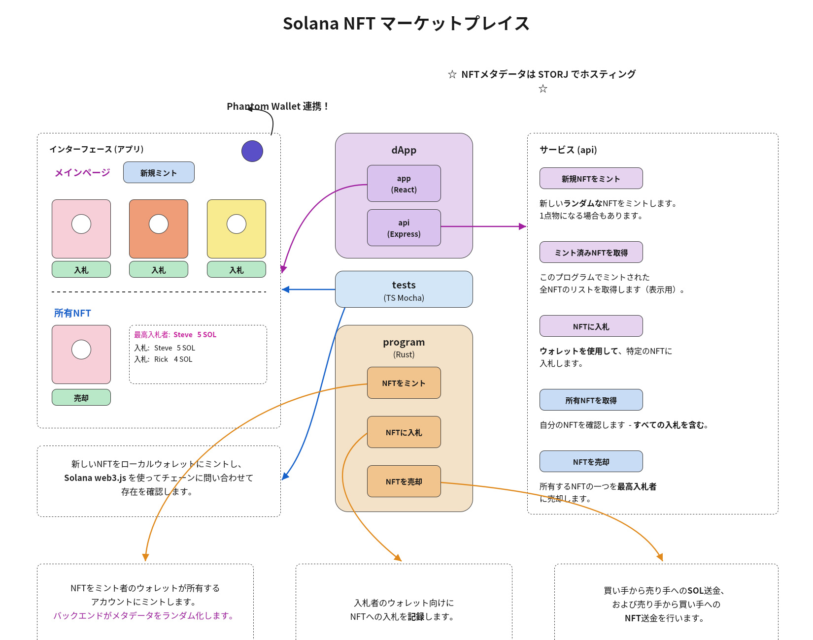

# Solana NFTマーケットプレイス

🇯🇵 [日本語](README.md) | 🇺🇸 [英語](README.en.md)

## 仕組み


## 開発環境のセットアップ

### Node.js、npm、Yarn
お使いのオペレーティングシステムに適した方法で`nodejs`と`npm`をインストールしてください。Windows上のWSL2を含む多くのLinuxディストリビューションでは、[nvm](https://docs.microsoft.com/en-us/windows/dev-environment/javascript/nodejs-on-wsl)の使用が推奨されています。


次に、`yarn`をインストールします。
```
shell
npm install -g yarn
```

### Rust
`rust`、`cargo`、その他必要なライブラリをインストールします。
```
shell
curl https://sh.rustup.rs -sSf | sh
```
>[!NOTE]
> これはLinuxとmacOS向けです。**Windows**の場合は、[公式サイト](https://doc.rust-lang.org/cargo/getting-started/installation.html)を参照してください。

### Solana
```
shell
sh -c "$(curl -sSfL https://release.solana.com/v1.10.25/install)"
```
>[!NOTE]
> これはLinuxとmacOS向けです。 Windows の場合は、[オリジナルサイト](https://docs.solana.com/cli/install-solana-cli-tools) を参照してください。

### Anchor CLI
```
shell
npm install -g @project-serum/anchor-cli
```

### Candy Machine
`yarn` がインストールされていることを確認してください。 Metaplex CLI をインストールします。
```
shell
git clone https://github.com/metaplex-foundation/metaplex.git ~/metaplex
yarn install --cwd ~/metaplex/js/
```
正しくインストールされたことを確認します。
```
shell
ts-node ~/metaplex/js/packages/cli/src/candy-machine-v2-cli.ts --version
```

## このリポジトリを使用する
### クライアントを実行する
```
shell
anchor run test
```
または
```
shell
docker-compose up
```
### プログラムをデプロイする
```
shell
anchor build
anchor deploy
```
または
```
shell
docker-compose run program "anchor build && anchor deploy"
```

## インポートした IDL を使用する
[Solana Playground IDE](https://beta.solpg.io） を使用している場合 では、SolanaプログラムのIDLをインポートするには、プログラムをビルドし、ドロップダウンメニューから「Extra」→「IDL」を選択し、「Export」をクリックして、生成されたjsonファイルを「solpg」フォルダにドロップします。

その後、`api/src/service.ts`または`tests/nft-marketplace.ts`内の必要なコードのコメントを解除してください。
